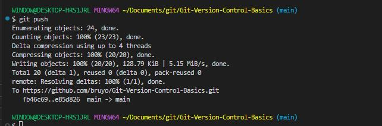

# Git-Version-Control-Basics

## Project Preview

### Version Control 
Version control is a system that tracks changes to files over time, enabling collaboration, rollback, and project management. Tools like Git allow developers to manage code revisions, merge contributions, and maintain history. It enhances teamwork, reduces errors, and supports efficient software development and deployment workflows across environments.

Version control is a critical component of modern software development, enabling teams to collaborate efficiently and manage code changes over time. Git, a distributed version control system, is one of the most widely used tools in the industry.

### Types of Version Control

- Centralized Version Control Systems (CVCS) like Subversion (SVN) and Perforce use a central server to store all versions of a project. Collaboration depends on access to the server, making them less flexible offline.

- Distributed Version Control Systems (DVCS) such as Git, Mercurial, and Bazaar allow every user to have a complete copy of the repository. Git, the most popular DVCS, supports branching, merging, and collaboration through platforms like GitHub, GitLab, and Bitbucket.

### Git Version Control

Git, a distributed version control system, is one of the most widely used tools in the industry. Git is a powerful and widely used distributed version control system that enables developers to track changes in their code, collaborate effectively, and manage project versions with ease. Created by Linus Torvalds in 2005, Git allows each user to have a complete copy of the project repository, supporting offline work and independent development.

Key features include branching, merging, and staging, which allow for efficient workflow management and experimentation without affecting the main codebase. With commands like git init, git add, git commit, git push, and git pull, users can record changes, share updates, and synchronize with remote repositories hosted on platforms like GitHub, GitLab, or Bitbucket.

Git also supports powerful tools for reviewing project history, resolving conflicts, and maintaining code integrity. Its flexibility, speed, and robustness have made it the standard version control tool in modern software development, supporting both solo developers and large-scale collaborative teams.

### Key Concepts Covered

- Initializing a Git repository (git init)

- Tracking changes with git add and git commit

- Viewing history with git log, git status, and git diff

- Branching and merging (git branch, git checkout, git merge)

- Handling merge conflicts

- Working with remote repositories (git remote, git push, git pull, git clone)

- Understanding .gitignore and commit best practices

## Tasks

### Creating a repository (Cloning a repository)

'git clone https://github.com/bruyo/Git-Version-Control-Basics.git'

### Creating a file

'touch index.html'

### Adding the file to the staging area

'git add index.html'
'git commit -m "adding file"'
'git push'

Cd

## GIT COMMANDS

#### GIT INIT

This git command is used to initialize a folder in a local directory.

'git init'

### GIT ADD

This git command is used to add and track files in git.

'git add . (for all files in a folder) or git add <file> (for a specific file)'

### GIT COMMIT

This git command is used to add files to the staging area from the working area or local repository.

'git commit -m "message"'

### GIT PULL

This git command helps to move files from your remote repository to your local or working directory.

'git pull'

### GIT PUSH

This git command is used to move files to the remote repository from the staging area.

'git push'

### GIT BRANCH

This git command is used to create a new branch and also switch branch.

'git branch <name>'

'git branch -m <name> <name>'

### GIT CHECKOUT

This git command is used to switch to another branch.

### GIT SWITCH

This git command is used to also switch to another branch.

'git switch <name>'

### GIT MERGE

This git command is used to merge two branches together.

'git merge <name> <name>

### GIT STATUS

This git command keep a record of changes.

'git status'

### GIT LOG

This git command gives the history of all activities and who was involved.

'git log'

### Conclusion
Version control tools are essential for managing and tracking changes in code or documents over time. They allow multiple users to collaborate efficiently, maintain a history of edits, and revert to previous versions when needed.
